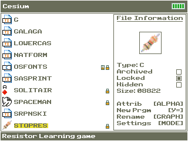

# Stop Resisting! TI-84 CE Edition
Stop Resisting! You __can__ learn resistor color codes!

This is a TI-84 version for my [stopresisting](https://github.com/the-real-mcarn/stopresisting) project to teach myself to read resistors. 
I made it on the TI-84 because the C-Toolchain is great and the TI-84 CE is an easy target with everything I needed (buttons, screen, battery, etc.)

Right now it is hardcoded to ask for resistors in the E96 range but if I feel like it I will include more menus to change that around.
The program intentionally mimicks the look of official TI-84 programs like probability simulator. 

## Links
- [TI-84 CE OS Fonts on Cemetech](https://www.cemetech.net/downloads/files/2143/x2531)
- [Ti-84 CE C/C++ Toolchain](https://ce-programming.github.io/toolchain/)